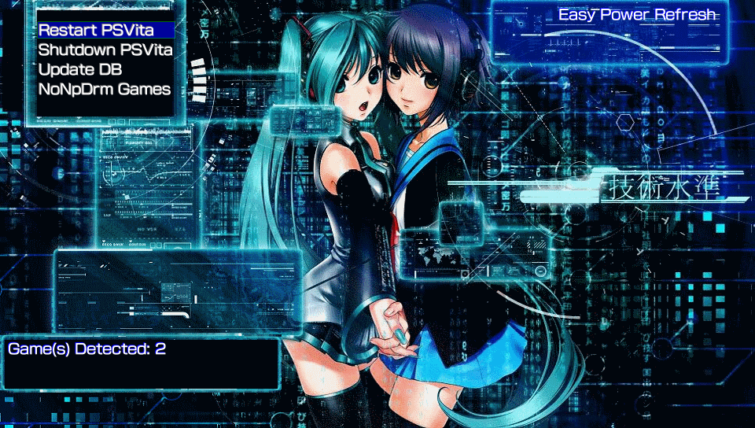
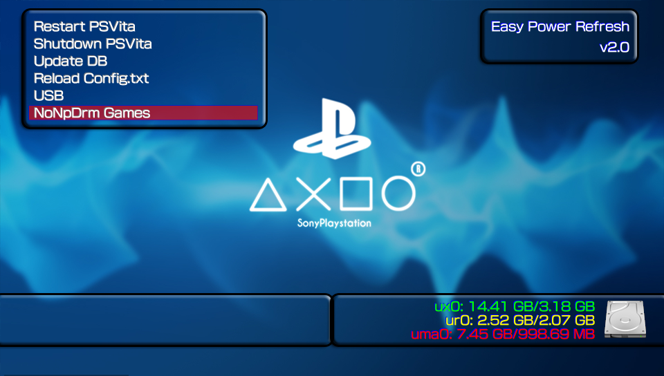

# Easy Power Refresh
**Power Options + NoNpDrm Games Installer all together in one app!.**

### Description ###
This simple app was made for the users who wanted to have all the options mentioned above in the same vpk.
With Easy Power Refresh you'll get the next options in an easy to use menu:

1. **Restart PSVita**   -> This option will restart the console.
2. **Shutdown PSVita**  -> This option will turn off the console.
3. **Update DB**        -> This option will update your games DB (you will not lose the bubbles layout in the livearea).
4. **NoNpDrm Games**    -> This option will search for non installed games in NoNpDrm format 
                      and install them (based on vitashell's Livearea Refresh).

## NOTE: ##
**To be able to use option "NoNpDrm Games" you must have correctly installed the  ([NoNpDrm](https://github.com/TheOfficialFloW/NoNpDrm/releases/tag/v1.1)) by TheFloW!**

Please feel free to report any issue or bugs.

## Credits: ##
**TheFloW** for the **NoNpDrm plugin** and the Vitashell **Livearea Refresh option**.
