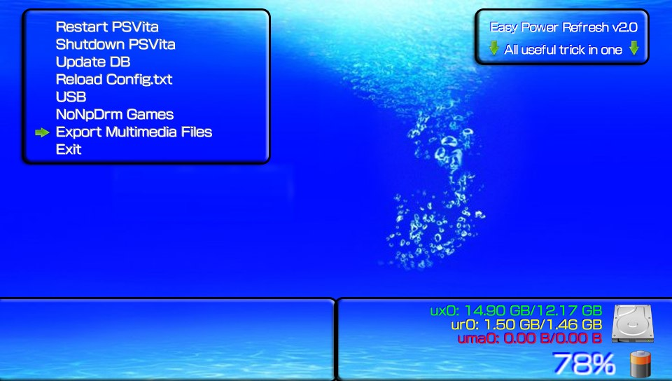

# Easy Power Refresh
**Power Options + NoNpDrm Games Installer all together in one app!.**

### Description ###
This simple app was made for the users who wanted to have all the options mentioned above in the same vpk.

### Changelog 2.01 ###
- Add Export Multimedia file : mp3, mp4, jpg, png (file must be in "ux0:Multimedia"). 
- Add an batterie indicator. 
- New PIC0 and backgroung. 
- New ressources thanks to Chronoss. 

	
### Changelog 2.00 ###
**Changes thanks to Chronoss:**
- Add Reload Config.txt. 
- Add Conexion USB. 
- New resources. 

With Easy Power Refresh you'll get the next options in an easy to use menu:

1. **Restart PSVita**           -> This option will restart the console.
2. **Shutdown PSVita**          -> This option will turn off the console.
3. **Update DB**                -> This option will update your games DB (you will not lose the bubbles layout in the livearea).
4. **Reload Config.txt**        -> This option will reload the config.txt file in "ux0:tai" folder.
5. **USB**                      -> This option let you connect your PSVita on PC in USB mode like VitaShell.
6. **Export Multimedia Files**  -> This option will export multimedia from "ux0:Multimedia" folder to Music/Picture or Video app
7. **NoNpDrm Games**            -> This option will search for non installed games in NoNpDrm format 
                                   and install them (based on vitashell's Livearea Refresh).
8. **Exit**                     -> To exit the application

## NOTE: ##
**To be able to use option "NoNpDrm Games" you must have correctly installed the  ([NoNpDrm](https://github.com/TheOfficialFloW/NoNpDrm/releases/tag/v1.1)) by TheFloW!**

Please feel free to report any issue or bugs.

## Credits: ##
**TheFloW** for the **NoNpDrm plugin** and the Vitashell **Livearea Refresh option**.
